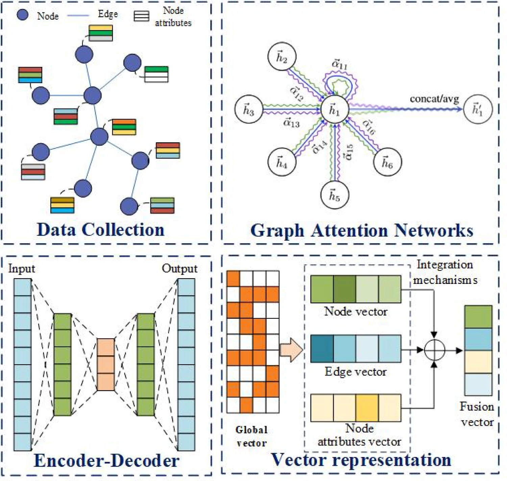

# Anomaly Detection in Social Media

## Overview
Anomaly detection in social media is essential for identifying cyberbullying, hate speech, misinformation, spam, and other malicious behaviors. This project uses user behavior characteristics, including textual content and interactive behaviors, to detect anomalies accurately and efficiently.

---

## Anomaly Detection Architecture

---

## I. Anomaly Detection Based on User Behavior Characteristics

### A. Textual Feature Extraction
This section focuses on analyzing user-generated text to identify anomalous social behaviors. Techniques such as NLP, data mining, and dimensionality reduction aid in extracting and analyzing content features.

#### Purpose
Detect anomalies related to:
- **Cyberbullying**
- **Hate Speech**
- **Misinformation**
- **Spam**

#### Methods
- **Natural Language Processing (NLP)**
- **Data Mining**
- **Dimensionality Reduction**

#### Key Studies and Approaches
- **Hao et al.**
  - Defined four abnormal behaviors: aggression, injury, arrest, and fatality.
  - Methods: Support Vector Machine (SVM) and trigger words for identifying anomalous sentences.
  - Used a behavioral co-construction network to detect anomalies in online opinion data.

- **Mu et al.**
  - Built an attention self-encoder with multi-head attention to handle missing data and capture text distributions for enhanced anomaly detection.

- **Al et al.**
  - Used Latent Dirichlet Allocation (LDA) to extract features from user content.
  - Developed a large-scale platform for malicious activity detection.

- **Qasim et al.**
  - Integrated features from content, social graph, and profile activity to analyze anomalies across large networks.

- **Drif et al.**
  - Used entity similarity calculation to reduce false positives in anomaly detection.

#### Challenges
- **Data Limitations**: Limited datasets can restrict feature extraction capabilities.
- **Language and Cultural Nuance**: Difficulties in capturing complex language and cultural variations.
- **Privacy vs. Detection**: Balancing user privacy with effective anomaly detection.

#### Advanced Techniques
- **Word Embeddings & Neural Networks**: Improved feature extraction through deep learning methods, enabling detection of subtle anomalies in text data.

---

### B. Feature Selection Based on Interactive Behaviors
This approach involves analyzing user interaction behaviors on social networks to identify unusual activities. It looks at variables such as post frequency, likes, comments, and discussion topics.

#### Focus
Identify key features based on interactive behaviors that correlate with unusual user activity.

#### Methods
- **Clustering Techniques**: Group users based on interaction features.
- **Combined Clustering and Classification**: Detect anomalous patterns in behavior.

#### Key Studies and Approaches
- **Aljably et al.**
  - Identified behaviors like post frequency, timing, likes, comments, and topic diversity as anomaly indicators.
  - Used clustering to group users and trained models based on these groups.

- **Persia et al.**
  - Developed an advanced event detection framework using modified Interactive Structured Query Language (ISQL).
  - Applied Local Differential Privacy (LDP) for data protection.
  - Used sequential pattern mining to detect frequent behaviors and predict trends.

#### Advantages and Challenges
- **Advantages**: 
  - In-depth behavior analysis enhances accuracy and reliability in detecting minor changes.
- **Challenges**:
  - High data demands, sensitivity to noisy data, and heavy computational needs.
  - Privacy issues due to extensive user interaction data collection.

---

## II. Anomaly Detection Based on Network Topological Structure

In social networks, malicious users may disguise their activity to blend in with genuine users while carrying out harmful actions. Text-based classifiers often struggle to identify these covert anomalies. Instead, using **network topology**—the arrangement of connections among users—offers a powerful approach for anomaly detection. Deviations in network structures, like irregular linkages, unusual clustering, or atypical centrality measures, can indicate anomalous behavior.

---

### A. Network Topology Overview
Anomaly detection via network topology focuses on identifying irregularities within **graph-based data structures**. Social networks are modeled as graphs \( G = (V, E) \), where:
- \( V \): Set of users (nodes)
- \( E \): Set of connections (edges) among users, with each edge \( e \in E \) representing a relationship between nodes \( u \) and \( v \).

The feature extraction process, illustrated in **Fig. 2** ("Anom_SM_topology_feature_extraction.webp"), shows how data is gathered from a graph database, processed with a **Graph Convolutional Network (GCN)**, and transformed into vector representations for anomaly detection.

### B. Key Concepts in Network Topology Anomalies

1. **Node Anomalies**
   - Refers to individual users whose behavior significantly deviates from the norm within the network.
   - Examples include spammers or malicious users involved in harmful activities.

2. **Group Anomalies**
   - Focuses on identifying subgraphs with interaction patterns that appear chaotic or abnormal.
   - Includes organized groups engaged in fraudulent schemes or other collaborative harmful behaviors.

3. **Interaction Anomalies**
   - Involves detecting irregularities in user interactions by analyzing specific edges in the graph.
   - Anomalous edges may display a low probability of occurrence or a sudden change in interaction weight (e.g., frequency of communication).
   - For instance, noticeable shifts in communication patterns can indicate network anomalies.

---

### C. Advantages of Topological Anomaly Detection
- **Comprehensive Detection**: Network structure analysis captures both individual and group behaviors that textual analysis might miss.
- **Behavioral Insight**: Topology-based detection sheds light on underlying social structures and hidden relationships.

### D. Challenges
- **Complexity**: Processing large network graphs can be computationally intensive.
- **Data Sensitivity**: Requires careful handling of user interaction data to respect privacy while ensuring effective detection.

---
## III. Anomaly Detection Based on Collaborative Fusion

### Overview
Anomaly detection using collaborative fusion involves integrating user attributes (e.g., age, location, workplace) with network topological structures to provide a more comprehensive analysis of social behaviors. This method enhances the detection of anomalies by combining node attributes and interaction characteristics, thus improving the accuracy of anomaly detection in social networks.

- **Challenge**: Traditional network topology methods often overlook critical node or edge attributes, which can result in lower detection accuracy.
- **Solution**: Collaborative fusion combines topological and attribute-based analyses to enhance detection accuracy and efficiency.

---

### Collaborative Fusion Architecture

---

### Key Concepts

#### A. Node and Edge Attributes
- **Node Attributes**: Details such as user age, residence, and engagement frequency.
- **Edge Attributes**: Nature, type, and duration of interactions between nodes.

#### B. Benefits of Collaborative Fusion
- **Enhanced Accuracy**: Improves detection by utilizing additional metadata linked to nodes and edges.
- **Dimensionality Reduction**: By selecting relevant features, it reduces data noise and dimensionality, resulting in faster processing times.
- **Adaptability**: Increases the generalization ability to adapt
