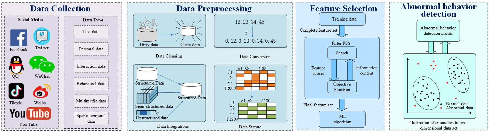

# Anomaly Detection in Social Media

## Anomaly Detection Based on User Behavior Characteristics

### Textual Feature Extraction
- **Purpose**: Detect anomalies such as cyberbullying, hate speech, misinformation, and spam.
- **Methods**: 
   - Natural Language Processing (NLP)
   - Data Mining
   - Dimensionality Reduction
- **Objective**: Analyze textual content based on the subject for identifying unusual social behaviors.

### Key Studies and Approaches
- **Hao et al.**:
   - Defined four abnormal behaviors: aggression, injury, arrest, fatality.
   - Methods: Support Vector Machine (SVM) and trigger words for filtering anomalous sentences.
   - Developed a behavioral co-construction network for detecting anomalies in online public opinion data.
- **Mu et al.**:
   - Built an attention self-encoder with multi-head attention to handle missing data and capture text distribution.
   - Used this for enhanced anomaly detection.
- **Al et al.**:
   - Employed Latent Dirichlet Allocation (LDA) to extract features from user content.
   - Developed a platform for large-scale malicious activity detection.
- **Qasim et al.**:
   - Combined content, social graph connections, and profile activity to analyze anomalies across large social networks.
- **Drif et al.**:
   - Implemented entity similarity calculation to reduce false positives in anomaly detection.

### Challenges
- **Data Limitations**: Small dataset sizes limit feature extraction capabilities.
- **Language and Cultural Nuance**: Complex language, cultural, and linguistic differences make anomaly detection challenging.
- **Privacy vs. Detection**: Finding a balance between protecting user privacy and effectively detecting anomalies.

### Advanced Techniques
- **Word Embeddings & Neural Networks**: Deep learning methods improve feature extraction, helping to identify subtle anomalies within text-based contexts.
